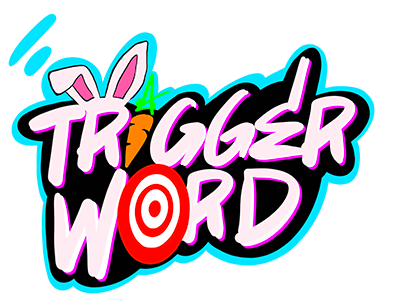

<div align="center">



**Say a word while you're talking and it plays the sound. No hotkey, nothing to alt-tab to.**

*A [Hopzle Toolkit](https://hopzle.com/) app — free, and it runs entirely on your own PC.*

### [⬇ Download TriggerWord for Windows](https://github.com/scarylasers/triggerword/releases/latest)

</div>

---

## What it does

A soundboard you operate by talking. You pick the words; when you say one mid-sentence,
the sound fires. You never reach for a key or glance at a second screen.

That matters most in VR, where your hands are busy being hands — but it works the same
on any stream.

Say **"quiet"** and everything playing fades out, which is what makes triggering whole
songs practical instead of just one-liners.

## Getting it

1. **[Download the installer](https://github.com/scarylasers/triggerword/releases/latest)**
   and run it. It installs just for you, so it never asks for an administrator password.
2. Windows will probably say **"Windows protected your PC"**. That appears for any app
   without a paid certificate. Click **More info**, then **Run anyway**.
3. Open **TriggerWord** from your desktop or Start menu.

**You need:** Windows 10 or 11, and **Chrome or Edge** installed — the speech recognition
and the per-sound output routing are both Chromium features. Everything else, Python
included, is bundled.

## Using it

1. **Click Allow** when it asks for your microphone. Nothing works without it.
2. **Import the starter pack** — ⚙️ Settings → *Import backup* → `TriggerWord-Starter-Pack.zip`,
   which ships with the app. You get SCARYLASERS sounds, songs and a few favourites.
3. **Press Listen for triggers** and say one of the words on the cards.
4. **Add your own** with ➕: give a trigger one word or several, and attach as many sounds
   as you like — it picks one at random each time, which is what keeps a trigger funny.

📖 **[The user guide](guide.html)** covers the rest — tabs, favourites, keyboard shortcuts,
recording your own drops, and time-shift capture for grabbing the funny thing *after* it
happened. It is installed with the app: ⚙️ Settings → ❓ User Guide.

🎚️ **[The audio routing guide](routing.html)** is the one to read if you want teammates to
*hear* your soundboard, or their voices to *trigger* it. That takes Voicemeeter, and it has
a diagram.

## A word about restraint

There is a very fine line between *funny* and *annoying*, and a soundboard that listens sits
right on it. A sound that lands once is a joke; the same sound five times a minute is a
reason to mute you.

So: pick words you actually say at moments that deserve a sound, and leave the cooldowns
alone — a trigger that just fired won't fire again immediately, on purpose. Every sound is
also measured once when you add it and the loud ones turned down, so nothing startles
anyone.

The people listening did not consent to an airhorn.

## Back up your sounds

Your library lives in your browser's storage. That is normally fine, but browsers get
cleared and profiles get reset.

**Export backup (everything)** writes one ZIP with your sounds, triggers, favourites,
shortcuts, settings and volume trims. Keep it somewhere that isn't your browser.
**Import backup** puts it all back — and that same ZIP is a normal soundpack, so you can
hand it to a friend.

## If something goes wrong

**The device dropdowns are empty.** Microphone permission was denied at some point and the
browser remembered. Open `chrome://settings/content/microphone`, allow
`http://localhost:8002`, and restart.

**Nothing happens when you speak.** First check it is actually listening — the status by
the transcript says *Not listening* until you press ▶. If it is listening and you have more
than one microphone, Chrome may be on the wrong one: press the 🎤 button, then in the tab
that opens press ▶ and click the microphone icon in the address bar to choose. Chrome picks
the microphone for speech recognition, not TriggerWord.

**Sounds play to the wrong device.** Set the output device in the app, not just in Windows —
each sound is routed individually.

Anything else, bring it to the [Hopzle Discord](https://discord.gg/r4z4EVnt9U).

## Your privacy

**TriggerWord sends nothing anywhere.** No account, no sign-in, no telemetry, no server of
its own. Your sounds, triggers and settings live in your browser on this machine and are
never uploaded. The only thing the app itself contacts is GitHub, about once a day, to see
whether a newer version exists — if you're offline it carries on quietly.

**One honest exception, and it isn't ours: speech recognition is Chrome's.** When you press
play, Chrome does the listening, and unless it has on-device speech models installed it
sends that microphone audio to Google to be turned into text — the same as any website
using this feature. TriggerWord never receives or stores that audio, and the words are
matched against your triggers here on your machine, but the recognition itself is Google's
service.

If that matters to you, `chrome://components` shows whether the on-device *Speech
Recognition* models are installed; with them, Chrome can transcribe locally.

## Running it from source

The installer is the easy road. If you'd rather run the source — and it's the same app —
clone the repo and double-click **`start-triggerword.bat`**. You need
[Python](https://www.python.org/downloads/) with *Add Python to PATH* ticked; no packages
are required for the basic app.

That route also unlocks two extras, if you `pip install -r requirements.txt`:

- **Offline speech recognition** with a local Whisper model, instead of the browser's.
- **Global hotkeys** — <kbd>F13</kbd>–<kbd>F24</kbd> fire triggers even when the window
  isn't focused, which is what makes macro pads and stream decks work.

```bash
node --test        # 28 tests, no dependencies to install
```

Persistence and levelling live in `persistence.js` as pure functions with no DOM or storage
access, which is what makes them testable outside a browser. All the I/O stays in
`index.html`.

## Open for everyone

It is **GPL-3.0**, so fork it, fix it, point it at something else entirely. If you share
your version you have to share its source too, which means nobody can take this
closed-source. Issues and pull requests welcome — see **[NOTICE.md](NOTICE.md)** for what
the licence does and does not cover (the artwork, the names and the starter-pack songs stay
ScaryLasers').

---

<div align="center">

**[hopzle.com](https://hopzle.com/)** · [Discord](https://discord.gg/r4z4EVnt9U)
· [YouTube](https://www.youtube.com/@ScaryLasers)
· [Twitch](https://www.twitch.tv/scarylasers)
· [Ko-fi](https://ko-fi.com/scarylasers_)

you're welcome… — SCARYLASERS 🐰

</div>
